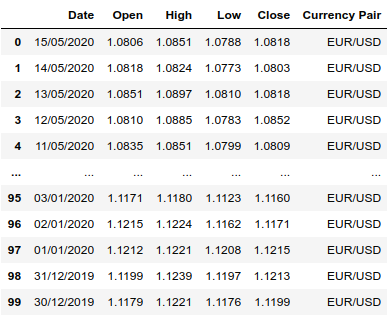

# Fixing and Interest Rates provider

This script addresses one of the most common necessities in any finance department; availability of fixing and interest rates quotes.

## :boom: Rates every working day

The idea came from the necessity to upload rates in a daily fashion without having to do it manually. EURIBOR and EONIA interest rates are gathered from the EMMI webpage while fixing quotes are gathered by making calls to the Alpha Vantage API. Both sources are free, however, the API gives you 1.000 free calls per month and you will need to create an account. Check out the API [here](https://www.alphavantage.co/ "Alpha Vantage") and the EMMI webpage [here](https://www.emmi-benchmarks.eu/emmi/ "European Money Markets Institute").

Even though this python script only takes into account the closing price of any given pair (EUR/USD, EUR/GBP, etc), the API has many other useful functions and tools worth checking out.

<p align="center">
  
</p>

## :chart_with_upwards_trend: Output
It returns a pandas dataframe filtered by date and rate. This data frame is also saved as a csv file. Historical rates are stored in a csv file called Historical_Rates.csv.

<p align="center">
  
</p>

## :computer: Technology stack
Written in python 3. Main modules:

**Pandas** -> Data manipulation, cleansing and analysis.

**Matplotlib** -> Charting and visualization.

## :wrench: Configuration
### Step 1

Install Python 3.7 and mandatory dependencies listed in the requirements file.

If you are using the Anaconda distribution. Run the following command to create a new environment named "rates_env"

```
conda env create -f requirements.yml
```

if you don't happen to be running conda, don't despair. There is also a requirements.txt file you can use to install all necessary modules. Remember to install python first.
```
pip install python
pip install -r requirements.txt
```

**Note:** Environment managers differ from one another. It's strongly recommended to check its documentation.

### Step 2
Go to the Alpha Vantage page and get your API key. This key is mandatory if you want to look up FX rates.

<p align="center">
  
</p>

### Step 3
Update main.py script by changing the following parameters:

*API_KEY* -> String. API key obtained in the previous step.

*local* -> String. Where the historical data will be saved to. 

*saveto* -> String. Filtered data file name.

*rates_to_look_up* -> List. Rates to look up and save to the Historical Rates csv file. 

*years* -> List. Only applicable to interest rates. 

filter_list -> List. Rates to look up in the Historical Rates file.

from_date -> String. Date filter, initial date. Inclusive.

to_date = String. Date filter, final date. Inclusive.

<p align="center">
  
</p>


## :information_source: Data info

Interest rates can be found [here](https://www.emmi-benchmarks.eu/emmi/ "European Money Markets Institute").

Fixing quotes are gathered making API calls from [here](https://www.alphavantage.co/ "Alpha Vantage").


## :file_folder: Folder structure
```
└── project
    ├── .gitignore
    ├── .env
    ├── requirements.txt
    ├── requirements.yml
    ├── README.md
    ├── main.py
    ├── readme
    │   └── readme images
    ├── notebooks
    │   └── Rates.ipynb
    ├── packages
    └── data
        └── Historical_Rates.csv
```

## :love_letter: Contact info
Doubts? Advice?  Drop me a line! :smirk:
